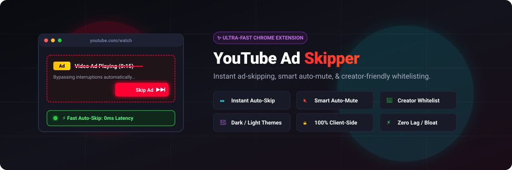
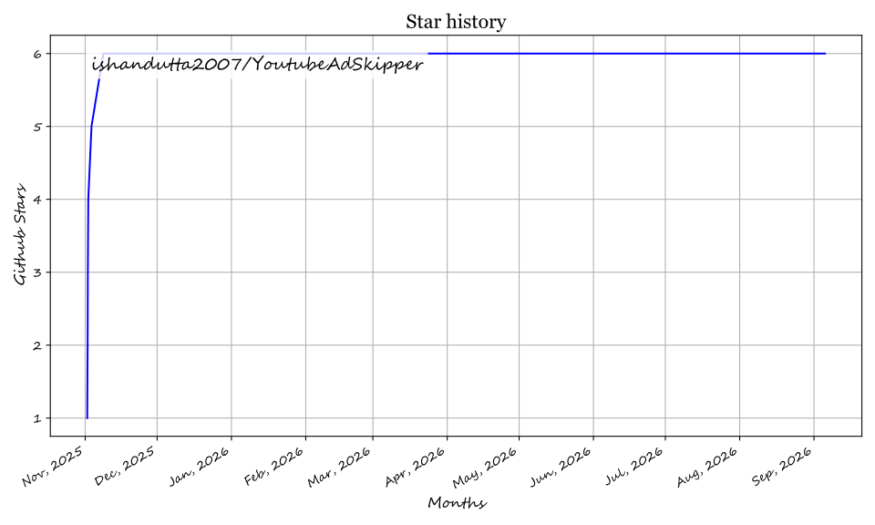

# YouTube Ad Skipper Chrome Extension — Fast & Automatic YouTube Ad Blocker & Auto Skipper 🚀

<p align="center">
  
</p>

<p align="center">
  <a href="https://github.com/ishandutta2007/Awesome-Awesome-Awesome"></a><a href="https://discord.gg/jc4xtF58Ve"></a>
  <a href="https://chrome.google.com/webstore"></a>
  <a href="LICENSE"></a>
  <a href="https://github.com/ishandutta2007/YoutubeAdSkipper"></a>
  <a href="https://github.com/ishandutta2007"></a>
</p>

An open-source, ultra-lightweight **YouTube Ad Skipper Chrome Extension** ⚡ that automatically skips video ads, closes popups and banner ads 🚫, and mutes non-skippable YouTube ads 🔇 without breaking video playback. Enjoy seamless, uninterrupted YouTube streaming with customized rules 🎯, channel whitelisting 🤍, and dark mode support 🌙.

---

## ⚡ Overview & Key Benefits 🌟

Tired of constant interruptions and waiting through unskippable video ads? **YouTube Ad Skipper** is designed as a smooth, high-performance alternative to heavy ad blockers:
- ⏩ **Instant Auto-Skip:** Automatically detects and clicks the "Skip Ad" button the millisecond it appears.
- 🔇 **Auto-Mute Ads:** Automatically mutes audio during non-skippable ads so your listening flow is uninterrupted.
- 🤍 **Creator-Friendly Whitelisting:** Easily whitelist your favorite YouTube channels to support the creators you love.
- 🔒 **Lightweight & Privacy-Focused:** No network overhead, zero tracking, no third-party analytic scripts, and minimal CPU/RAM usage.
- 🌙 **Dark Mode & Modern UI:** Match your browser theme or choose between System, Light, and Dark modes.

---

## 🚀 Features ✨

- ⚡ **Automated Ad Skipping:** Clicks "Skip Ad" buttons instantly with zero delay or custom configurable delays (0–10s).
- 🚫 **Overlay & Banner Ad Removal:** Automatically detects, hides, and dismisses overlay ads and banner teasers.
- 🔇 **Smart Mute for Non-Skippable Ads:** Automatically mutes the video player when ads cannot be skipped immediately and restores volume once the video resumes.
- 🎯 **Custom Skip Rules:** Toggle video ad skipping and banner ad dismissal independently.
- 🤍 **Channel Whitelist Management:**
  - Whitelist specific YouTube channels directly from the popup.
  - Support your favorite content creators while blocking ads on the rest of YouTube.
- 🌙 **Theme & Dark Mode Support:**
  - System default, Light, and Dark themes.
  - Automatically matches your operating system appearance.
- 🔄 **Cross-Device Sync:** Settings and whitelisted channels sync across devices via `chrome.storage.sync`.
- 🔋 **Single-Page Application (SPA) Optimized:** Seamlessly works through YouTube's dynamic page transitions and playlist autoplay.

---

## 📦 Installation & Setup 🛠️

### Option 1: Load Unpacked Extension (Developer Mode) 💻

1. Clone or download this repository:
   ```bash
   git clone https://github.com/ishandutta2007/YoutubeAdSkipper.git
   ```
2. Open Google Chrome and navigate to `chrome://extensions/`.
3. Enable **Developer mode** toggle in the top-right corner.
4. Click **Load unpacked** in the top-left menu.
5. Select the project directory (`YoutubeAdSkipper`).
6. The extension is now active on [YouTube](https://www.youtube.com/)! 🎉

### Option 2: Package Extension (.crx) 📦

1. In Chrome, go to `chrome://extensions/`.
2. Enable **Developer mode**.
3. Click **Pack extension** and specify the project root folder.
4. Chrome will generate a `.crx` distribution file and a `.pem` key file.

---

## ⚙️ How It Works 🔍

1. 👁️ **MutationObserver & Interval Fallback:** Employs a highly optimized DOM `MutationObserver` combined with an interval check to detect ad banners, video overlays, and skip buttons as soon as they render.
2. 🔄 **Dynamic SPA Navigation Support:** Uses `yt-navigate-finish` listeners and YouTube DOM events to smoothly maintain skip functionality during continuous playlist playback.
3. 🔊 **Audio Control:** Hooks into YouTube's HTML5 video element (`<video>`) to mute ad audio without breaking player state.

---

## 📂 Project Structure 📁

```text
YoutubeAdSkipper/
├── manifest.json       # Manifest V3 extension configuration
├── content.js          # Core ad detection and auto-skip logic
├── background.js       # Background service worker (theme & settings sync)
├── popup.html          # Extension settings & whitelisting interface
├── popup.js            # Popup controls, toggles, and UI interactions
├── icons/              # Browser extension action icons
│   ├── icon16.png
│   ├── icon48.png
│   └── icon128.png
├── assets/             # Visual banners & preview graphics
│   ├── banner.svg
│   └── social-preview.gif
└── README.md           # Documentation
```

---

## 🔒 Permissions & Privacy 🛡️

This extension strictly abides by minimal-privilege principles and respects user privacy:
- 📑 **`activeTab` & `scripting`:** Used solely to interact with active YouTube video pages and apply user skip settings.
- 🌐 **`host_permissions` (`*://*.youtube.com/*`):** Restricted exclusively to YouTube domains.
- 🛡️ **100% Client-Side:** No telemetry, no external server calls, and no data tracking or analytics. All configurations are stored locally or synced via Chrome's encrypted storage.

---

## ❓ Frequently Asked Questions (FAQ) / Troubleshooting 💡

<details>
<summary><b>Why aren't ads skipping automatically? ⚠️</b></summary>

1. Ensure the extension is enabled in `chrome://extensions/`.
2. Check if the current channel is on your whitelist in the extension popup.
3. Refresh the YouTube tab.
4. Check if other conflicting extensions or ad blockers are interfering.
</details>

<details>
<summary><b>Does this hurt YouTube creators? ❤️</b></summary>

You can support your favorite YouTubers anytime! Use the one-click **Whitelist Channel** button in the popup menu to allow ads on channels you love.
</details>

<details>
<summary><b>Is this extension safe and free? 🛡️</b></summary>

Yes. It is completely free, open source, and runs entirely in your browser without collecting personal information.
</details>

---

## 📝 Changelog 📌

- **2025-11-04:** Added Dark Mode support (System / Light / Dark) with theme persistence via `chrome.storage.sync`.
- **Custom Skip Rules:** Introduced adjustable skip delays, independent video/overlay toggles, and channel whitelisting.

---

## 🤝 Contributing 💡

Contributions, issues, and feature requests are welcome!
1. Fork the project.
2. Create your feature branch (`git checkout -b feature/AmazingFeature`).
3. Commit your changes (`git commit -m 'Add some AmazingFeature'`).
4. Push to the branch (`git push origin feature/AmazingFeature`).
5. Open a Pull Request.

---

## 👥 Contributors & Credits 👏

- [Valent-p](https://github.com/Valent-p) — Core development, custom skip rules, channel whitelisting, and dark mode implementation.
- [ishandutta2007](https://github.com/ishandutta2007) — Repository maintainer.

---

## 📈 Star History

[](https://star-history.dera.page/#ishandutta2007/YoutubeAdSkipperNew&type=date&legend=top-left)

---

## 📄 License 📜

Distributed under the MIT License. See [LICENSE](LICENSE) for more information.

## Star History

<a href="https://star-history.com/#ishandutta2007/YoutubeAdSkipper&Timeline" align="center">
  <picture>
    <source media="(prefers-color-scheme: dark)" srcset="assets/ishandutta2007_YoutubeAdSkipper_growth.svg">
    
  </picture>
</a>
